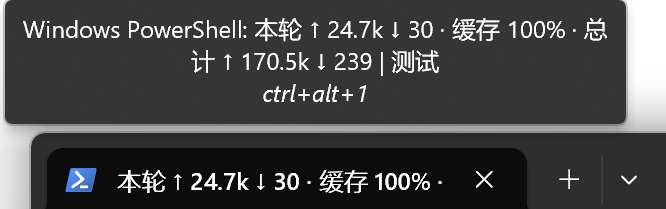
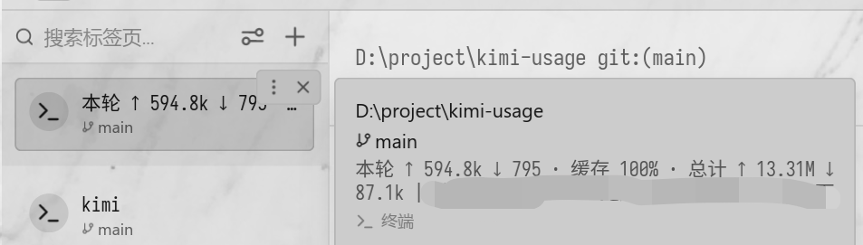
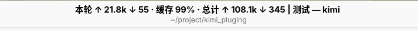

# kimi-usage

**[Kimi Code CLI](https://github.com/MoonshotAI/kimi-code) 插件：把 token 用量显示在终端标题栏。**

每轮对话结束时，插件会把本轮 token 用量、缓存命中率和会话累计写入终端标题：

```
本轮 ↑ 1.26M ↓ 8.4k · 缓存 99% · 总计 ↑ 19.15M ↓ 115.8k | 会话标题
```

## 效果预览

| Windows Terminal | Warp | Linux (GNOME Terminal) |
| --- | --- | --- |
|  |  |  |

> **为什么是标题栏？** kimi-code 目前没有任何能在不污染模型上下文的前提下向 TUI 显示自定义文本的渠道：statusLine 配置不存在，hook 输出要么被丢弃、要么会注入上下文烧 token。标题栏是唯一同时满足**零上下文消耗、轮末时机、不破坏 TUI** 的显示方式。等官方提供可自定义的 statusLine 或其他显示能力后，本插件会迁移，详见[后续计划](#后续计划)。

- **零上下文消耗** —— 不会有任何内容被注入模型上下文
- **精确到轮末** —— 由 `Stop` hook 驱动，模型结束本轮的瞬间触发
- **零依赖** —— 单个 Python 3.7+ 标准库脚本

## 安装

前置条件：系统已安装 Python 3.7+，且 `python` 或 `python3` 在 `PATH` 上。

在 Kimi Code CLI 的 TUI 中：

```
/plugins install https://github.com/YD-233/kimi-usage
/reload
```

之后每轮结束标题自动更新。

- 卸载：`/plugins remove kimi-usage`
- 指定版本：`/plugins install https://github.com/YD-233/kimi-usage/releases/tag/v1.0.5`

## 平台支持

| 平台 | 状态 |
| --- | --- |
| Linux | 已验证（GNOME Terminal；理论上任何支持 OSC 标题的终端都行） |
| macOS | 已支持（Terminal.app、iTerm2 等支持 OSC 标题的终端；未实机验证，欢迎反馈） |
| Windows | 已验证（Warp、Windows Terminal；新版 conhost 同理） |

已知限制：

- TUI 在切换会话、会话改名、`/reload` 时会重置标题；下一轮结束时会写回。
- 终端必须能显示标题变化。Windows 上 mintty（Git Bash 默认终端）不走 conhost，无法显示标题——请使用 Windows Terminal、Warp 等现代终端。

## 工作原理

- Kimi Code 的 `Stop` hook 在模型结束一轮时触发，而 hook 引擎会**丢弃**它的 stdout。插件反其道而行之：命令照跑，但任何东西都不可能进入模型上下文。
- Linux/macOS 上脚本先沿父进程链找到 TUI 的控制终端（Linux 读 `/proc`，macOS 没有 `/proc`，改用 `ps`），再向它写入 OSC 0 转义序列；Windows 上改用 `SetConsoleTitleW` 直接设置控制台标题。三者都不打印可见字符、不移动光标，因此不影响 TUI 的差分渲染。
- 用量数据来自 `~/.kimi-code/sessions/<工作目录>/<会话>/agents/*/wire.jsonl` 中的 `usage.record` 记录（每次 LLM 调用一条；轮边界由 `turn.prompt` 划分）。子 agent 的用量按时间戳归属到对应的轮。

## 后续计划

标题栏显示是现阶段的权宜之计，一旦官方提供以下任一能力，插件会第一时间迁移显示方式：

- **可自定义的 statusLine / 状态栏 API**——最理想的形态，常驻 TUI 底部
- 其他不进入模型上下文的展示渠道，例如 hook 输出可选择不注入上下文、插件自定义 UI 面板等

迁移后标题栏写入会保留为可选的兜底方式（比如在 ssh、tmux 等场景下仍然有用）。

## License

MIT
