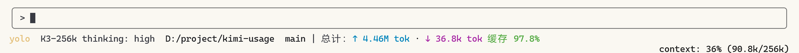
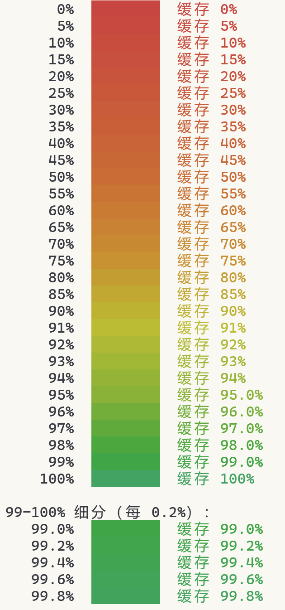
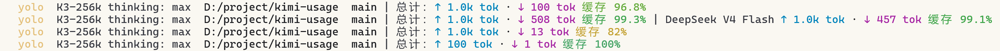

# kimi-usage

**[Kimi Code CLI](https://github.com/MoonshotAI/kimi-code) 插件：把当前会话的 token 用量显示在 TUI 底部状态栏。**



需要 kimi-code ≥ 0.30.0（[0.30.0](https://github.com/MoonshotAI/kimi-code/releases/tag/%40moonshot-ai%2Fkimi-code%400.30.0) 起支持 `[status_line].command` 自定义底部状态栏）。

## 状态栏显示什么

一行，`|` 分隔左右：

- **左侧**：模式徽标（`yolo`/`auto`/`plan`/`swarm`，仅激活时显示）、当前模型与思考强度（如 `K3-256k thinking: high`）、工作目录、git 分支——外观与内置状态栏一致
- **右侧**：整会话（主 agent + 全部子 agent）的总输入 `↑`、总输出 `↓`、缓存命中率；有子 agent 时按模型各列一段同样三项，按输入量降序

缓存命中率带健康渐变：低红高绿，95% 以上显示一位小数（如 `97.8%`），现代渠道常见的高缓存区间每一格都可分辨：



不同用量下的整行效果：



> 想预览/调整配色，仓库自带预览脚本：`python scripts/preview_colors.py`

## 特性

- **零上下文消耗** —— 不向模型上下文注入任何内容
- **实时更新** —— 状态栏每秒刷新，模型每次调用后立即可见
- **子 agent 按模型分列** —— 多模型混跑时各自花了多少一目了然
- **跨平台零依赖** —— Linux / macOS / Windows，单个 Python 3.7+ 标准库脚本
- **自适应终端宽度** —— 行宽超出终端时按代价逐级退让：单位 `token` → `tok` → 省略，然后依次丢 git 分支、目录、`总计：`、`缓存` 标签、收紧 `·` 间距，再按用量从小到大丢子 agent 分列；窗口调宽后自动恢复完整显示

## 安装

前置条件：kimi-code ≥ 0.30.0，Python 3.7+（`python` 或 `python3` 在 `PATH` 上）。

```
/plugins install https://github.com/YD-233/kimi-usage
/reload
```

然后新开一个会话（`/new`）或重启 CLI，再执行 `/reload-tui`（或等下次启动），底部状态栏即开始显示。

- 已有自定义 `[status_line]` 段时插件**不会覆盖**；想换成本插件，把该段的 `command` 删掉或指向 `plugins/managed/kimi-usage/scripts/statusline.py` 即可
- 升级/指定版本：`/plugins install https://github.com/YD-233/kimi-usage/releases/tag/v1.4.3`

## 卸载与恢复

- 卸载：`/plugins remove kimi-usage`
- 恢复内置状态栏：禁用插件，或删掉 `~/.kimi-code/tui.toml` 里 `# >>> kimi-usage` / `# <<< kimi-usage` 两条标记之间的块

## 调试

状态栏命令失败时 TUI 会静默回退到内置布局。诊断日志写到 `~/.kimi-code/kimi-usage-debug.log`，两种开启方式：设 `KIMI_USAGE_DEBUG=1`（需重启 CLI），或 `touch ~/.kimi-code/kimi-usage-debug` 建一个开关文件（即时生效，删文件即关闭）。设 `KIMI_USAGE_NO_COLOR=1` 可输出纯文本。

也可以手动喂一个 JSON 快照，直接看脚本输出：

```bash
printf '{"sessionId":"YOUR_SESSION_ID","cwd":"/your/project"}' | \
  python3 ~/.kimi-code/plugins/managed/kimi-usage/scripts/statusline.py
```

## License

MIT
