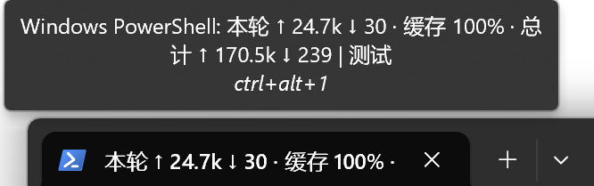
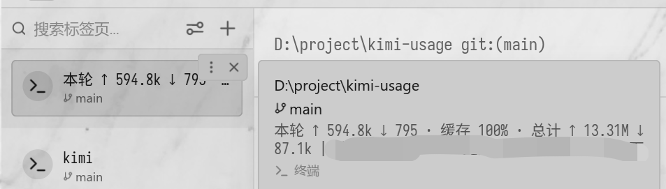
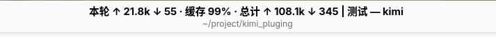

# kimi-usage

**[Kimi Code CLI](https://github.com/MoonshotAI/kimi-code) 插件：把每轮 token 用量与缓存命中率显示在 TUI 底部状态栏。**

kimi-code 0.30.0+ 开始支持 `[status_line].command` 自定义底部状态栏（[#0.30.0](https://github.com/MoonshotAI/kimi-code/releases/tag/%40moonshot-ai%2Fkimi-code%400.30.0)）。插件提供一个状态栏命令 `scripts/statusline.py`，每秒从会话的 `wire.jsonl` 中汇总出当前轮的 token 用量、缓存命中率和会话累计：

```
本轮 ↑ 1.26M ↓ 8.4k · 缓存 99% · 总计 ↑ 19.15M ↓ 115.8k
```

旧版 kimi-code 或不支持状态栏的终端会自动回退到原来的**终端标题栏**显示：

```
本轮 ↑ 1.26M ↓ 8.4k · 缓存 99% · 总计 ↑ 19.15M ↓ 115.8k | 会话标题
```

## 效果预览

| Windows Terminal（标题栏兜底） | Warp（标题栏兜底） | Linux（标题栏兜底） |
| --- | --- | --- |
|  |  |  |

> 状态栏方式不再需要终端支持 OSC 标题，任何能跑 kimi-code TUI 的平台都可以使用。

## 特性

- **零上下文消耗** —— 不会向模型上下文注入任何内容
- **实时更新** —— 状态栏每秒刷新一次，轮末瞬间即可看到最新数据
- **精确到轮** —— 用量按 `turn.prompt` 划分的轮边界统计，子 agent 用量按时间戳归属
- **跨平台** —— Linux / macOS / Windows 均可使用状态栏方式
- **零依赖** —— 单个 Python 3.7+ 标准库脚本

## 安装

前置条件：系统已安装 Python 3.7+，且 `python` 或 `python3` 在 `PATH` 上。

### 1. 安装插件

在 Kimi Code CLI 的 TUI 中：

```
/plugins install https://github.com/YD-233/kimi-usage
/reload
```

### 2. 配置状态栏命令

kimi-code 0.30.0+ 需要在 `~/.kimi-code/tui.toml` 里启用 `[status_line]` 命令。打开该文件，加入：

```toml
[status_line]
command = "python3 ~/.kimi-code/plugins/managed/kimi-usage/scripts/statusline.py || python ~/.kimi-code/plugins/managed/kimi-usage/scripts/statusline.py"
```

> 如果修改过 `KIMI_CODE_HOME` 环境变量，请将 `~/.kimi-code` 替换为实际的数据目录；Windows 上默认对应 `%USERPROFILE%\.kimi-code`。

保存后执行 `/reload-tui`（只重载界面配置）或 `/reload`（同时重载其他配置），底部状态栏即开始显示用量。

### 3. 旧版兜底

如果你用的是 kimi-code 0.29.x 或更早版本，插件会自动通过 `Stop` hook 把用量写入终端标题栏，无需配置 `tui.toml`。

### 常用命令

- 卸载：`/plugins remove kimi-usage`
- 指定版本：`/plugins install https://github.com/YD-233/kimi-usage/releases/tag/v1.2.0`

## 平台支持

| 平台 | 状态栏 | 标题栏兜底 |
| --- | --- | --- |
| Linux | 支持（kimi-code ≥ 0.30.0） | 已验证（GNOME Terminal 等支持 OSC 标题的终端） |
| macOS | 支持（kimi-code ≥ 0.30.0） | 已验证（支持 OSC 标题的终端均可） |
| Windows | 支持（kimi-code ≥ 0.30.0） | 已验证（Windows Terminal、Warp；新版 conhost 同理） |

已知限制：

- 标题栏兜底模式下，TUI 在切换会话、会话改名、`/reload` 时会重置标题；下一轮结束时会写回。
- 标题栏兜底要求终端能显示标题变化。Windows 上 mintty（Git Bash 默认终端）不走 conhost，无法显示标题——请使用 Windows Terminal、Warp 等现代终端。

## 工作原理

- **状态栏方式**：kimi-code 0.30.0+ 每秒把当前会话快照（`sessionId`、`cwd`、上下文用量等）以 JSON 形式通过 stdin 喂给 `[status_line].command`。`scripts/statusline.py` 根据 `sessionId` 定位到 `~/.kimi-code/sessions/<工作目录>/<会话>/agents/*/wire.jsonl`，汇总 `usage.record` 记录后输出一行用量文本。TUI 取 stdout 第一行显示在底部。脚本含有一个轻量缓存，按 `wire.jsonl` 修改时间失效，避免每秒重复解析大文件。
- **标题栏兜底**：每轮结束时 `Stop` hook 触发 `scripts/usage.py`，它同样解析 `wire.jsonl`，但通过 OSC 0（Linux/macOS）或 `SetConsoleTitleW`（Windows）把结果写入终端标题。stdout 被 hook 引擎丢弃，因此**不会进入模型上下文**。
- 用量数据来自 `wire.jsonl` 中的 `usage.record` 记录（每次 LLM 调用一条；轮边界由 `turn.prompt` 划分）。子 agent 的用量按时间戳归属到对应的轮。

## 调试

状态栏命令失败时，TUI 会静默回退到内置状态栏。排查方法：

```bash
# 手动喂一个 JSON 快照，看脚本输出什么
printf '{"sessionId":"YOUR_SESSION_ID","cwd":"/your/project"}' | \
  python3 ~/.kimi-code/plugins/managed/kimi-usage/scripts/statusline.py
```

标题栏兜底模式可用 `KIMI_USAGE_DEBUG=1` 查看写到了哪个设备：

```bash
KIMI_USAGE_DEBUG=1 kimi
```

## License

MIT
